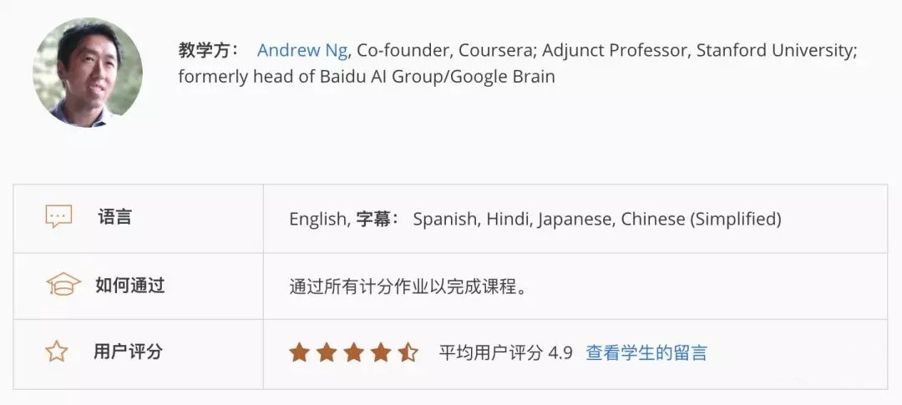
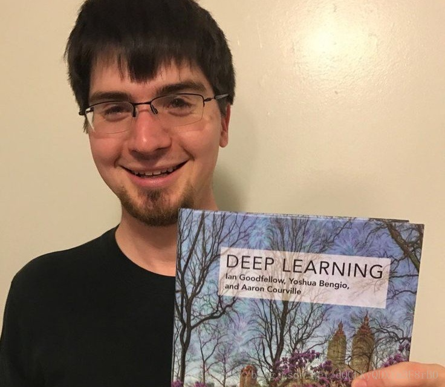
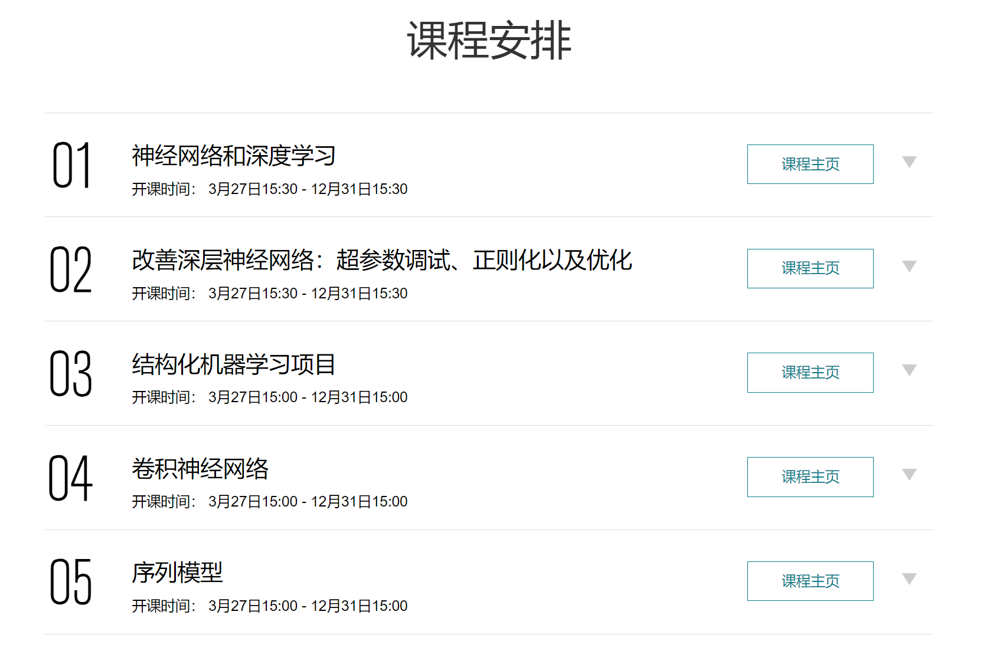

# Roadmap

本文是面向深度学习的入门教程，帮助初学者快速了解深度学习的核心概念，并具备基本的编程技能，从而为科研和实践打下基础。

## 机器学习基础

对于零基础的同学还是建议从经典机器学习入手，虽然经典的方法在实践中并不常见，但深度学习中很多概念都是从机器学习方法来的，pipeline也是相通的。流行的方法一直在变，掌握基础是最重要的。

最受欢迎的入门教程就是**吴恩达**的机器学习了，这门课程最大的优点就是能把晦涩的概念用通俗易懂的方式讲出来。这门课虽然只是一个入门课程，却涵盖了线性回归、逻辑回归、梯度下降、神经 网络、支持向量机、聚类等等大部分重要概念，上到编程实践下到线性代数，可以让你对机器学习的整个脉络有一个准确的理解。

* coursera版：<https://www.coursera.org/learn/machine-learning>
* 网易云课堂版：<https://study.163.com/course/courseMain.htm?courseId=1004570029>

参考资料看**西瓜书**就可以，因为吴恩达的课程故意省略了部分不好懂的理论，讲到相应章节的时候翻翻西瓜书，对照地看一看，是最好的效果。

## 涉足深度学习

**花书**是深度学习的经典教材，覆盖了深度学习大部分重要主题。这本书前几章对线代、概率论、信息论有一个简单的介绍，如果对数学知识已经忘得差不多了可以看一下。前十章都是非常重要的主题，如果没有时间通读可以大体了解大概，在用到的时候再回头翻阅，加深理解。仓库中提供了本书的英文版，方便查找关键字。

如果你觉得吴恩达的视频课程还不错的话，可以继续学习吴恩达的**深度学习**系列课程。这个课程首先是覆盖了深度学习最重要的几个方向，并且会有意识地培养使用库、阅读文献的意识，所以这是个很综合的训练。

如果觉得吴恩达讲的太慢太基础，想找一个更偏应用的教程，可以选择**fast.ai**的MOOC。这是另一个很受欢迎的深度学习的课程，主讲是kaggle比赛大神Jeremy Howard。fast.ai同时也是一个基于pytorch的深度学习库，有兴趣的同学可以了解一下。

* 课程地址：<https://course.fast.ai/>

实战是最好的学习，这个时候就可以跑一些小项目了。这类资源网上有很多，但是对于初学者来说最好的资源是pytorch和tensorflow提供的**tutorial**，熟悉了基本流程就可以开始自己的项目了~

* <https://pytorch.org/tutorials/>
* <https://www.tensorflow.org/tutorials>

## 深度学习与质量保障

这一部分介绍了深度学习领域中与软工/质量保障相关的几篇经典论文，主要是抛砖引玉，让希望从事相关研究的同学快速的找到门路。

### 对抗攻击

对抗攻击是一个非常火爆的领域了。要入门这个领域，可以从最经典和基础的几种方法入手：

* [FGSM](https://arxiv.org/abs/1412.6572): 开山之作，相关工作标准Baseline
* [PGD](https://arxiv.org/pdf/1706.06083): 基于梯度的迭代攻击方法，还介绍了一种防御
* [DeepFool](https://ieeexplore.ieee.org/document/7780651): 另一种经典的快速的攻击
* [C&W](https://arxiv.org/abs/1608.04644): 效果最好的攻击方法之一，提供了多个版本

### 异常样本检测

* [ODIN](https://arxiv.org/abs/1706.02690): 提出了基于softmax概率进行改进的方法
* [Mahalanobis Distance](https://arxiv.org/abs/1807.03888): 另一个经典Baseline，基于马氏距离
* [Generalized ODIN](https://arxiv.org/abs/2002.11297): 对分类模型进行重新建模，非常不错的效果

到这个阶段就可以根据自己的需要看最新的论文了。
